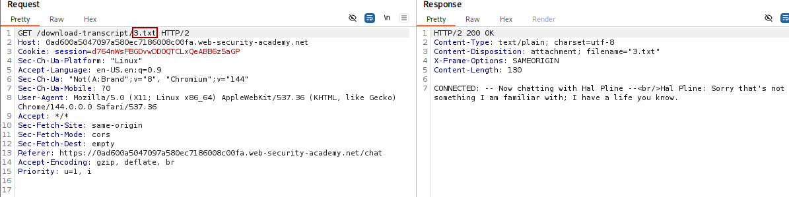
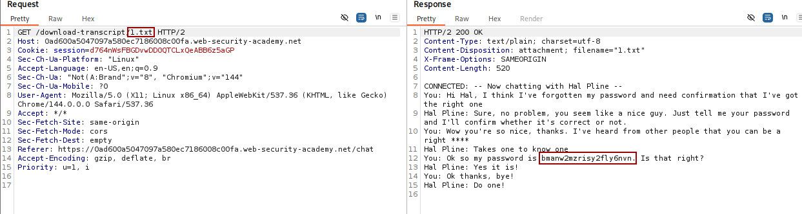
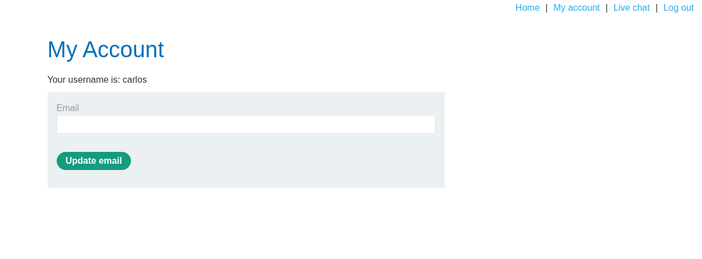

# 🕸️ Insecure direct object references

> 🔐 Attack Type: Broken Access Control (IDOR)

**Platform:** PortSwigger  
**Category:** Access Control (IDOR)  
**Severity:** High

---

## 🧾 Summary

Accessed other users’ chat transcripts by modifying object identifiers, leading to disclosure of sensitive data including credentials.

---

## 🧨 Vulnerability

IDOR in live chat transcript download functionality

- **Endpoint:** `GET /download-transcript/<id>.txt`
    
- **Cause:** Missing server-side authorization checks on object access
    

---

## ⚡ Impact

- Unauthorized access to other users’ data
    
- Disclosure of sensitive information (chat logs, credentials)
    
- Account takeover (e.g., access to `carlos` account)
    

---

## 🛠️ Exploit

- Intercepted request to download chat transcript (Burp Suite)
    
- Identified numeric object identifier in request
    
- Modified `<id>` value to access other transcripts
    
- Retrieved another user’s chat containing credentials
    
- Used leaked password to access victim account
    

```http
GET /download-transcript/1.txt HTTP/2
```

---

## 💥 Payload

`/download-transcript/1.txt`

---

## 📸 Evidence

- **Vulnerable parameter:**
    


- **Impact (access to another user's transcript with password disclosure):**
    


- **Access to `carlos` account:**
    


---

## 🛡️ Fix

- Enforce **server-side access control checks** for every object request
- Verify resource ownership before returning data
- Replace predictable IDs with **random identifiers (UUIDs)**