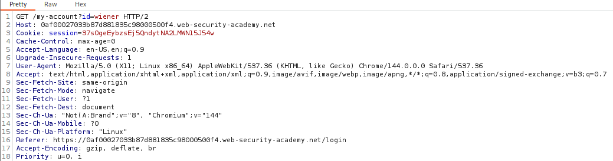
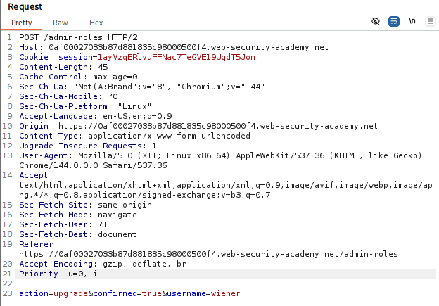
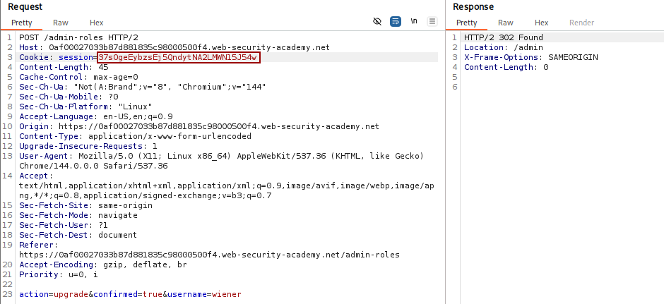
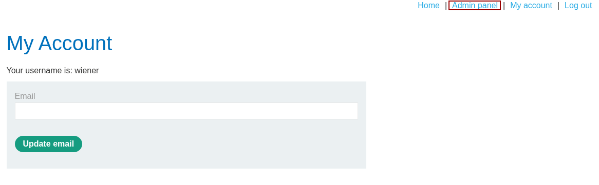

# 🕸️ Multi-step process with no access control on one step

**🔐 Attack Type:** Broken Access Control (Insecure Multi-step Workflow)

**Platform:** PortSwigger

**Category:** Broken Access Control

**Severity:** High

---

### 🧾 Summary

Escalate privileges of a normal user to administrator by exploiting a flaw where access control is not enforced on the final confirmation step of a multi-step administrative process.

### 🧨 Vulnerability

**Type:** Broken Access Control

**Endpoint:** `POST /admin-roles`

**Cause:** The server assumes that if a request reaches the "confirmation" step, the user has already been authorized in previous steps. It fails to re-verify the session's permissions upon receiving the final sub-request.

### ⚡ Impact

**Privilege Escalation:** A low-privileged user can execute administrative functions (like promoting their own account) by directly sending the final request of a multi-step workflow.

---

### 🛠️ Exploit

1. Log in as **administrator** and initiate the "Upgrade user" process for the user `wiener`.
    
2. Intercept the final confirmation request using **Burp Suite**.
    
3. Copy the entire request, but replace the `session` cookie with the session ID of the low-privileged user (**wiener**).
    
4. Send the modified request. The server processes the upgrade despite the request coming from a non-admin session.
    

**Intercepted Request:**

HTTP

```
POST /admin-roles HTTP/2
Cookie: session=[WIENER_SESSION_ID]

action=upgrade&confirmed=true&username=wiener
```

### 💥 Payload

`action=upgrade&confirmed=true&username=wiener`

*(Sent from a low-privileged user session)*

---

### 📸 Evidence

- **Identifying the low-privileged user session:**



- **Intercepting the administrative multi-step confirmation request**:



- **Replaying the administrative request with a low-privileged session cookie:**



- **Verification of successful privilege escalation to administrator:**



---

### 🛡️ Fix

Implement **mandatory access control checks on every single step** of a multi-step process. Never assume that a user is authorized simply because they provide the correct parameters for a subsequent step in a workflow.