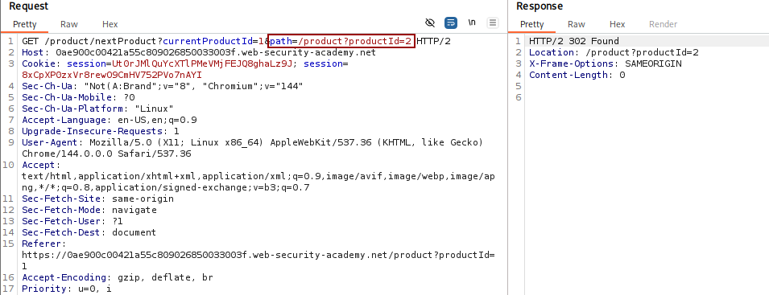
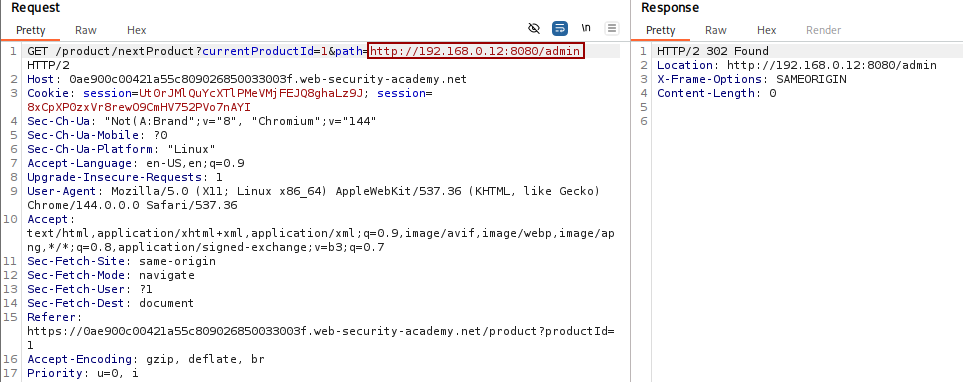

# 🕸️ SSRF with filter bypass via open redirection vulnerability

**🔐 Attack Type:** SSRF
**Platform:** PortSwigger
**Category:** SSRF
**Severity:** High

---

## 🧾 Summary

I gained unauthorized access to the local administrative interface. The application has a filter that prevents direct SSRF, but I bypassed it by using an **Open Redirection** vulnerability in a different part of the site.

## 🧨 Vulnerability

The application validates the `stockApi` parameter to prevent SSRF. However, `nextProduct` endpoint has an **Open Redirection** flaw that allows an attacker to redirect the backend server's request to any internal URL.

- **Vulnerable Endpoint:** `/product/nextProduct?path=<path>`
- **Cause:** The server trusts the `path` input and places it directly into the `Location` header of a **302 Redirect** response.

## ⚡ Impact

An attacker can:

- Access internal administrative panels not reachable from the public internet.
- Perform administrative actions (viewing system status or deleting users).

---

## 🛠️ Exploit

1. **Intercept the stock check:** Use Burp Suite to capture a request to `/product/stock`.
    
2. **Test for Open Redirect:** Observe that `/product/nextProduct?path=<URL>` redirects the browser to any target.
    
3. **Combine the attacks:** Inject the redirection URL into the `path` parameter.
    
4. **Bypass the filter:** The server thinks it is calling its own `/product/nextProduct` (allowed), but then follows the redirect to the internal admin panel (blocked).
## 💥 Payload

`/product/nextProduct?path=http://192.168.0.12:8080/admin`

## 📸 Evidence

- **Vulnerable Parameter:**

- **Modified Request With Redirection:**

---

## 🛡️ Fix

- **Disable Redirection Following:** Configure the backend's HTTP client to **not** follow redirects automatically.
- **Input Validation:** Use a strict **allow-list** for the `path` parameter.