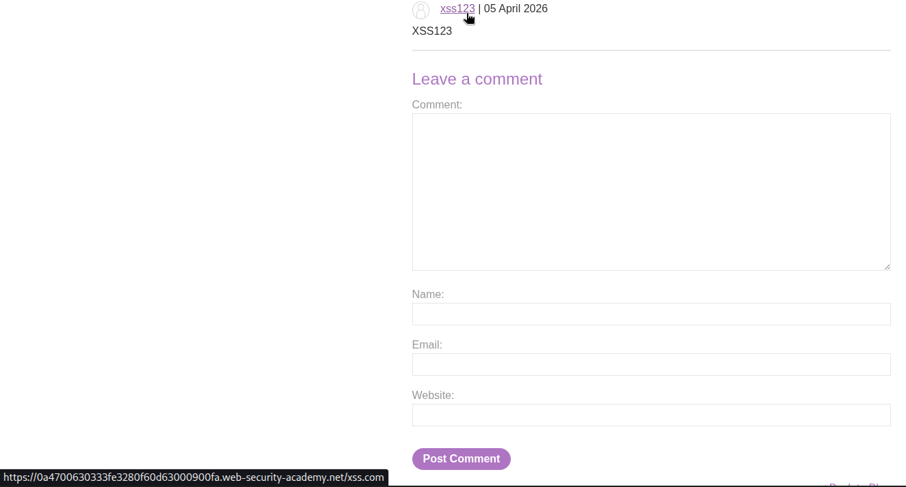
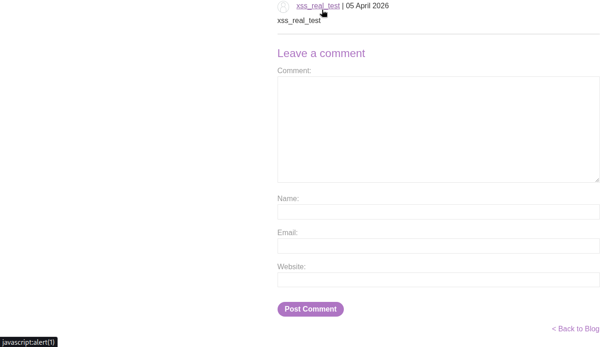

# 🕸️ Stored XSS into anchor href attribute with double quotes HTML-encoded

> 🔐 Attack Type: Stored XSS (Protocol Abuse)

**Platform:** PortSwigger  
**Category:** Cross-Site Scripting (XSS)  
**Severity:** Medium  

## 🧾 Summary

Injected malicious JavaScript via `href` attribute using `javascript:` protocol.

## 🧨 Vulnerability

Stored XSS in comment functionality

- **Endpoint:** `POST /post/comment`
- **Cause:** Lack of URL protocol validation

## ⚡ Impact

Attacker can execute JavaScript in victim’s browser -> session hijacking or phishing.

## 🛠️ Exploit

- Submitted comment with controlled URL
- Observed reflection inside `<a href="">`
- Injected `javascript:` payload
- Triggered execution on click

```html
<a href="javascript:alert(1)">Author</a>
````

## 💥 Payload

`javascript:alert(1)`

## 📸 Evidence

* **Expected Behavior:**

  

* **The Hack:**

  

## 🛡️ Fix

Validate and allow only safe URL protocols (http/https).