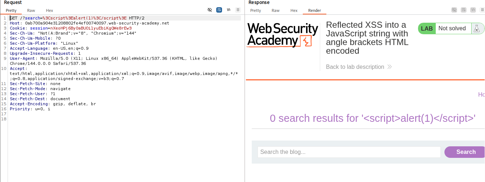
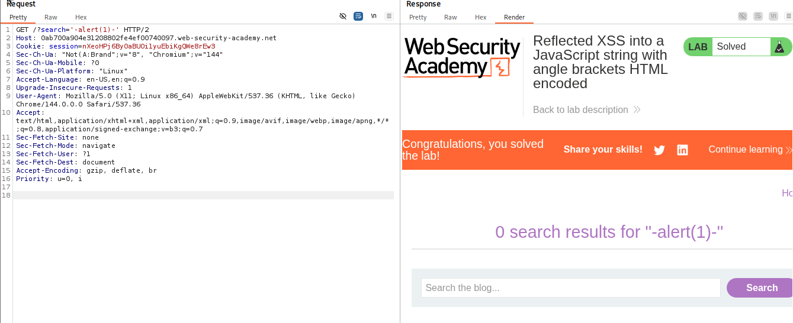
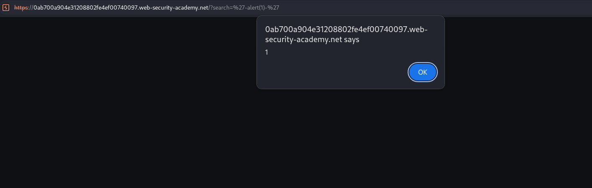

# 🕸️ Reflected XSS into a JavaScript string with angle brackets HTML encoded

> 🔐 Attack Type: Context Breakout XSS

**Platform:** PortSwigger  
**Category:** Cross-Site Scripting (XSS)  
**Severity:** Medium  

## 🧾 Summary

Exploited XSS by breaking out of a JavaScript string and executing arbitrary code.

## 🧨 Vulnerability

Reflected XSS in search functionality

- **Endpoint:** `GET /?search=`
- **Cause:** Improper output encoding in JavaScript context

## ⚡ Impact

Attacker can execute JavaScript in victim’s browser → potential account takeover.

## 🛠️ Exploit

- Input reflected inside JavaScript string
- Bypassed `< >` filtering
- Broke out using single quote
- Injected payload to execute code

```javascript
var searchTerms = 'INPUT';
````

```http
GET /?search='-alert(1)- HTTP/2
```

## 💥 Payload

`'-alert(1)-'`

## 📸 Evidence

* **Encoding Test:**

  

* **Modified Request:**

  

* **The Hack:**

  

## 🛡️ Fix

Use context-aware output encoding.